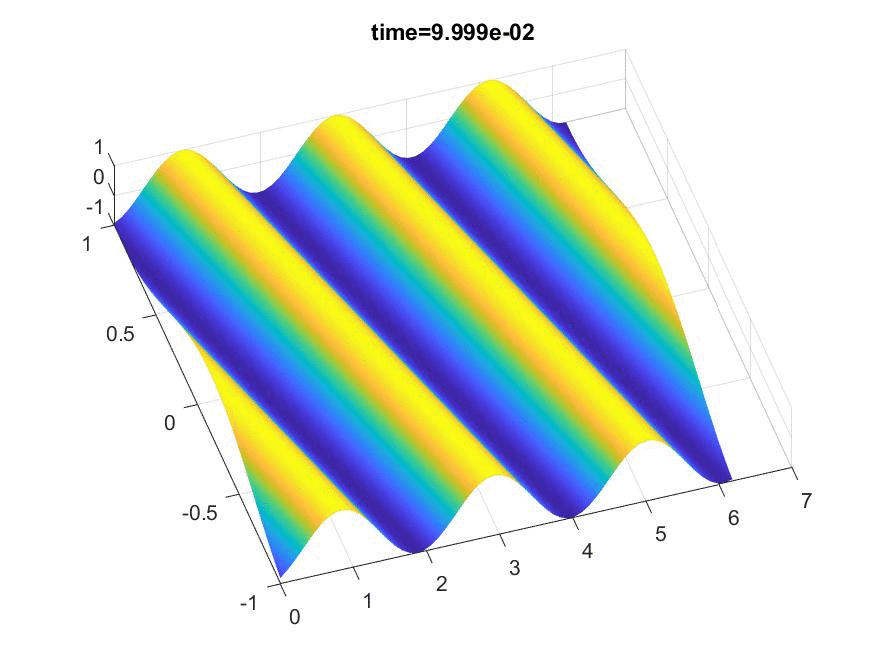

# Spectral_NavierStokes

Fourier-Fourier-Chebyshev 2D/3D Navier Stokes Solver for low Re Applications and Wind Turbines/Farms 

This is a repository for the codes developed for my M.Sc. thesis.

Folders are structured such that the complexity increases gradually. 
It is pretty much how I have introduced myself to the topic (from basics towards more complex)

